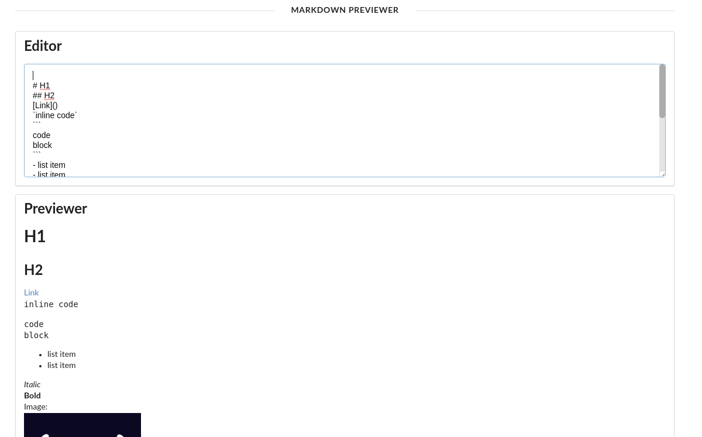

# FreeCodeCamp Frontend libraries certification: Markdown previewer project

### Getting started: `yarn start`
Runs the app in the development mode. 
Open [http://localhost:3000](http://localhost:3000) to view it in the browser.

The page will reload if you make edits. 
You will also see any lint errors in the console.
## Ressources
- [Create React App](https://github.com/facebook/create-react-app).
- [semanti ui](https://react.semantic-ui.com/)
- [marked](https://github.com/markedjs/marked)
